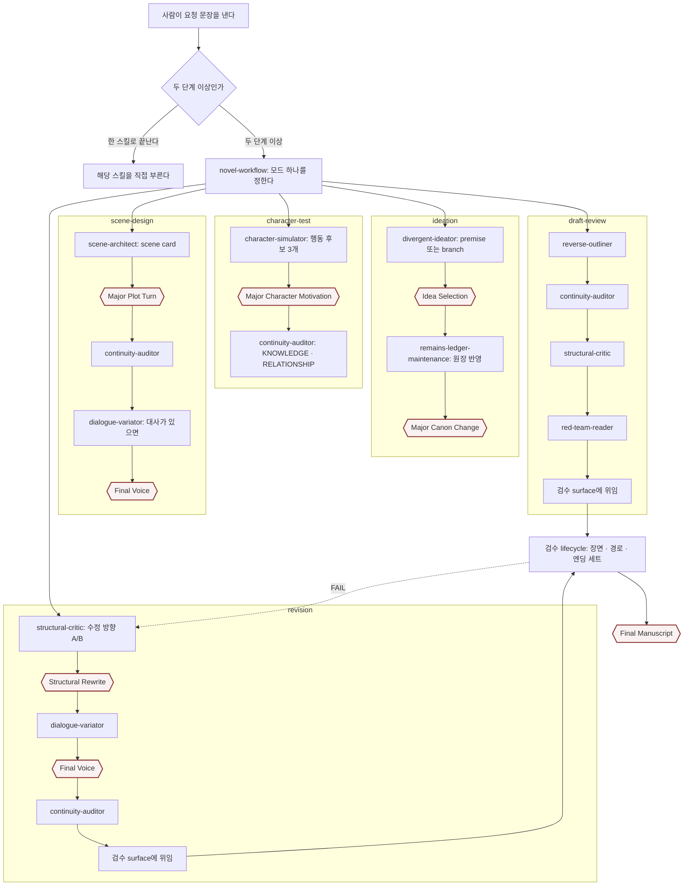
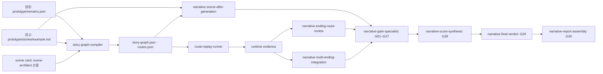

# 서사 워크플로우 — 진입 스킬과 파생 경로

루트의 [README](../../README.md)는 게임 자체를 설명한다. 이 문서는 그 게임의 **스토리를 쓰는 작업**이 어디서 시작해 어디로 파생되는지만 정리한다. 계약 원문은 [`.omp/skills/`](../../.omp/skills/)와 [`.omp/NARRATIVE_REVIEW.md`](../../.omp/NARRATIVE_REVIEW.md), 라우팅 표는 [`workflow-modes.md`](../../.omp/skills/novel-workflow/references/workflow-modes.md)에 있다.

## 사람이 최초로 부르는 스킬

**`novel-workflow`** — 라우터다. 요청이 **두 단계 이상**을 요구할 때 사람이 이것을 먼저 부르고, 이 스킬이 모드 하나를 정해 아래 파생 경로를 만든다.

들어가기 전에 걸리는 관문이 둘 있다.

| 경우 | 먼저 할 일 |
|---|---|
| 한 스킬로 끝나는 요청 (예: "장면 하나 사양 만들어줘") | 라우터를 거치지 않는다. 그 스킬(`scene-architect`)을 직접 부른다 |
| 세계관 설정을 **새로** 주는 경우 | 사람 승인 → `remains-ledger-maintenance`가 원장에 반영(새 도메인이면 `schema` 모드) → 그 뒤에 발산. `divergent-ideator`의 입력은 원장·원고로 고정돼 있어 붙여넣은 텍스트는 읽히지 않는다 |

## 파생도 — 모드가 정해지면 각 단계가 이어 붙는다

육각형이 **사람 게이트**다. 승인 없이는 다음 단계로 넘어가지 않는다. 검수에서 `FAIL`이 나오면 위로 흐르지 않고 `revision` 모드로 되돌아간다.

## 검수·종합으로 이어지는 꼬리

검수는 장면·경로·엔딩을 판정하고, 종합은 그 판정을 하나의 점수·등급·보고서로 고정한다.

`ending-set-architect`(엔딩 세트 설계)와 `story-graph-architect`(그래프 형태 설계)는 아직 없다. 제안 상태는 [후보 스킬 제안서](reference/candidate-skills.html)에 있다.

## 사람 게이트 — 여기서 도구가 멈춘다

| 게이트 | 걸리는 곳 |
|---|---|
| Idea Selection | `ideation` 1단계 뒤 |
| Story Premise Approval | 캠페인 전제를 확정할 때 |
| Major Character Motivation | `character-test` 1단계 뒤 |
| Major Plot Turn | `scene-design` 1단계 뒤 |
| Ending · Theme | 엔딩·주제를 정할 때 |
| Major Canon Change | `ideation` 2단계(원장 반영) 앞 |
| Structural Rewrite | `revision` 1단계 뒤 |
| Final Voice | 대사 대안을 고를 때 |
| Final Manuscript | 검수 위임 결과를 받아들일 때 |

승인 판정 기준은 **사람의 명시적 선택 문장**이다. 침묵, 추정, 이전 산출물의 존재는 승인으로 보지 않는다.

## 사람 손과 도구 손

- **사람:** 선택, 승인, 최종 결정. 캐논 쓰기 승인. 원고 쓰기(또는 `narrative-rewriter`에 범위 지정). 게이트 통과 판정.
- **도구:** 후보 생성, 진단, 사양 작성, 그래프 컴파일, 실행 증거 생성, 판정. 어느 것도 스스로 캐논에 닿지 않는다 — 캐논을 고치는 스킬은 `remains-ledger-maintenance` 하나뿐이다.

## 더 보기

- [워크플로우 한 장](reference/skill-pipeline.html) — 층별 역할과 제안 스킬이 앉는 자리
- [스킬 지도](reference/skill-map.html) — 스킬별 "왜 필요한가 / 무엇이 다른가"
- [게이트 색인](reference/gate-index.html) — G01~G30이 실제로 묻는 질문
- [MISSION.md](MISSION.md) · [lessons/](lessons/) · [RESOURCES.md](RESOURCES.md)
